 

  

 

### 👋 About Me

I'm a **Senior Python Full-Stack Engineer** with **6+ years of commercial experience** building scalable web applications, SaaS products, and enterprise-grade software. I own projects end-to-end — from architecture and API design to deployment and performance tuning — across the full stack: **Python / Django / FastAPI** on the backend, **React / Next.js** on the frontend, and **AWS / Docker** for infrastructure.

I'm also actively diving into **AI engineering** — integrating LLMs (OpenAI API) into production features, and applying prompt engineering to automate business processes and boost developer productivity.

- 🔭 Currently focused on **backend architecture, AI-powered features, and high-load API design**
- 🌱 Deepening expertise in **LLM integrations & AI-assisted engineering**
- 💼 Open to **remote / freelance opportunities** with international companies
- 📫 Reach me on **Telegram [@Ostap_R2](https://t.me/Ostap_R2)** or **rapavyiostap@gmail.com**

 

### 🛠️ Tech Stack

**Backend**
 

  

**Frontend**
 

  

**Databases & Cloud**
 

  

**AI**
 

 

### 💼 Experience

Over the past **6+ years**, I've grown from writing my first Django views to owning entire backend architectures for production systems handling real traffic and real consequences. Most of that time has been spent deep inside **Python** — and the more I work with it, the more I appreciate it. There's something genuinely satisfying about the language's clarity: you can express complex business logic in a way that reads almost like plain English, and that clarity scales — from a quick script to a distributed system with Celery workers and message queues humming in the background.

What I actually enjoy most isn't just "writing code that works" — it's the process of taking a vague business requirement and turning it into a clean, well-structured API that other engineers can build on top of without fighting it. I've spent a lot of time optimizing PostgreSQL queries that were bringing systems to a crawl, designing async processing pipelines with Redis and Celery so that heavy tasks don't block the user experience, and making sure the REST APIs I ship are secure and predictable enough to trust in production. I've also mentored junior engineers and led code reviews — not because I like pointing out mistakes, but because I remember what it felt like to be the person who needed that guidance, and I'd rather pass it forward.

Somewhere along the way, **AI stopped being a side curiosity and became something I'm genuinely excited about**. I started experimenting with the OpenAI API almost as a hobby — trying to automate a repetitive part of my own workflow — and it snowballed into something bigger: integrating LLMs directly into product features, writing prompts that actually hold up in production instead of just looking good in a demo, and thinking seriously about how AI agents and RAG pipelines will reshape the kind of software we build over the next few years. I spend a lot of my free time reading papers, testing new models, and prototyping small AI-powered tools, partly because it's genuinely fun, and partly because I think the engineers who understand both classic backend engineering *and* how to work with LLMs will be the ones building the most interesting products going forward. That's the intersection I want to keep living in.

 

### 🎓 Education

**MSc, Computer Science** — Ivan Franko National University of Lviv &nbsp;·&nbsp; 2021 – 2025

 

### 🎯 Currently Exploring

- 🤖 Multi-Agent Systems & Agentic Workflows
- 🔌 MCP (Model Context Protocol)
- 📚 Advanced RAG architectures
- ⚡ Event-Driven Architecture
- ☸️ Kubernetes

 

### 💬 Ask Me About

`Python` · `Django / FastAPI` · `REST API design` · `PostgreSQL performance` · `AWS & Docker` · `OpenAI API integrations` · `Prompt Engineering`

 

**Let's build something great together — reach out anytime.**

