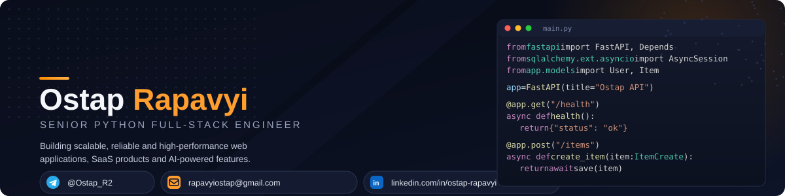

 

 

### 👋 About Me

I'm a **Senior Python Full-Stack Engineer** with **6+ years of commercial experience** building scalable web applications, SaaS products, and enterprise-grade software. I own projects end-to-end — from architecture and API design to deployment and performance tuning — across the full stack: **Python / Django / FastAPI** on the backend, **React / Next.js** on the frontend, and **AWS / Docker** for infrastructure.

I'm also actively diving into **AI engineering** — integrating LLMs (OpenAI API) into production features, and applying prompt engineering to automate business processes and boost developer productivity.

- 🔭 Currently focused on **backend architecture, AI-powered features, and high-load API design**
- 🌱 Deepening expertise in **LLM integrations & AI-assisted engineering**
- 💼 Open to **remote / freelance opportunities** with international companies
- 📫 Reach me on **Telegram [@Ostap_R2](https://t.me/Ostap_R2)** or **rapavyiostap@gmail.com**

 

### 🛠️ Tech Stack

**Backend**
 

  

**Frontend**
 

  

**Databases & Cloud**
 

  

**AI**
 

 

### 💼 Experience

<table>
<tr>
<td valign="top" width="130">

  
🟢 <b>Current</b>

</td>
<td valign="top">

#### Full Stack Engineer · Company under NDA

Delivered scalable backend services for confidential enterprise projects — designed secure, production-grade REST APIs and optimized PostgreSQL data models for high-load scenarios. Built asynchronous processing pipelines with **Redis & Celery** to raise system throughput, integrated third-party services, and shipped production-ready deployments with **Docker & AWS**.

    

</td>
</tr>
<tr><td colspan="2"> </td></tr>
<tr>
<td valign="top" width="130">

</td>
<td valign="top">

#### Full Stack Engineer · Tecco

Designed and built complex web applications end-to-end using **Django, FastAPI, React & Next.js**. Integrated **OpenAI APIs** into product features through prompt engineering, bringing AI-assisted functionality into live products and automating parts of the dev workflow. Implemented real-time functionality with **WebSockets**, built async & messaging infrastructure with **Redis & RabbitMQ**, participated in architecture decisions, led code reviews, and mentored junior engineers.

    

</td>
</tr>
<tr><td colspan="2"> </td></tr>
<tr>
<td valign="top" width="130">

</td>
<td valign="top">

#### Full Stack Engineer · SoftServe

Developed and maintained business web applications using **Django, Flask & React**. Built and consumed REST APIs supporting core business functionality, optimized PostgreSQL queries to improve response times, implemented new features, and collaborated closely within Agile development teams.

   

</td>
</tr>
</table>

 

### 🎓 Education

**MSc, Computer Science** — Ivan Franko National University of Lviv &nbsp;·&nbsp; 2021 – 2025

 

### 📊 GitHub Stats

> 

 

**Let's build something great together — reach out anytime.**

